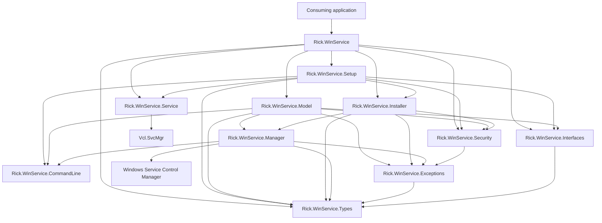
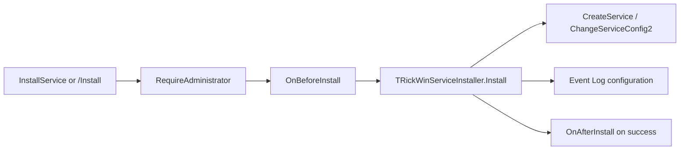
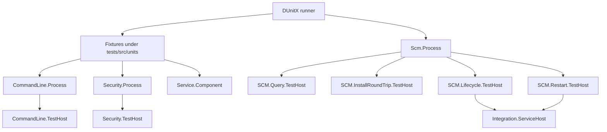

# Architecture

This document describes the architecture observable in the current state. It does not reconstruct the project's historical evolution.

## Overview

Rick WinService separates the API consumed by the application from the responsibilities of configuration, service execution, SCM access, installation, security, command-line handling, and errors.



The diagram shows relevant dependencies among the project's own units. RTL, VCL, FMX, and WinAPI dependencies have been summarized.

## `src` structure

The current package contains 11 `.pas` units and one main service DFM:

```text
src/
├── Rick.WinService.pas
├── Rick.WinService.Types.pas
├── Rick.WinService.Interfaces.pas
├── Rick.WinService.Exceptions.pas
├── Rick.WinService.Security.pas
├── Rick.WinService.Manager.pas
├── Rick.WinService.Installer.pas
├── Rick.WinService.CommandLine.pas
├── Rick.WinService.Model.pas
├── Rick.WinService.Setup.pas
├── Rick.WinService.Service.pas
└── Rick.WinService.Service.dfm
```

## Responsibilities

### `Rick.WinService.pas`

Main procedural facade. Exposes configuration, VCL/FMX identification, queries, administrative checks, and installation/control operations.

Observed internal implementation dependencies:

```text
Installer
Model
Security
Service
Setup
```

### `Rick.WinService.Types.pas`

Declares shared types only:

- `TRickWinServiceState`;
- `TInstallType`;
- `TRickWinServiceOperation`;
- `TRickApplicationFramework`;
- `TOnRickWinServiceEvent`.

Contains no execution logic.

### `Rick.WinService.Interfaces.pas`

Declares:

- `IRickWinService`;
- `IRickWinServiceSetup`.

Depends on `Rick.WinService.Types` and RTL types required by the contracts.

### `Rick.WinService.Exceptions.pas`

Declares the controlled exception hierarchy. Depends on `Rick.WinService.Types` for operations and states.

### `Rick.WinService.Security.pas`

Implements validation of the effective token against the Administrators group using `AllocateAndInitializeSid` and an explicit import of `CheckTokenMembership` from `advapi32.dll`.

`RequireAdministrator` raises `ERickWinServiceAdministratorRequired` when the process is not elevated.

### `Rick.WinService.Manager.pas`

Low-level gateway to the SCM. Observed responsibilities include:

- opening and closing SCM and service handles;
- registering and removing a service;
- changing the description;
- querying `SERVICE_STATUS_PROCESS`;
- starting, stopping, pausing, continuing, and sending shutdown;
- converting Win32 states to `TRickWinServiceState`;
- waiting for transitions;
- querying installation and running status by name.

The default internal timeout for `WaitForState` and `WaitForStateOrRaise` is `30000` ms.

While waiting, the code calculates the interval from `dwWaitHint div 10`, capped between 100 and 1000 ms, and tracks `dwCheckPoint` to detect lack of progress.

### `Rick.WinService.Installer.pas`

Installation and uninstallation core used by the facade and administrative commands.

During installation:

1. requires administrative privileges;
2. validates the service name and executable;
3. uses the internal name as the title when `ServiceTitle` is empty;
4. registers `SERVICE_WIN32_OWN_PROCESS`, `SERVICE_AUTO_START`, and `SERVICE_ERROR_NORMAL`;
5. configures `ImagePath` as `"<executable>" -RunService`;
6. applies the description through `ChangeServiceConfig2` when `ServiceDetail` is not empty;
7. attempts to configure the Event Log source.

If a failure occurs after service creation, rollback attempts to remove the registration and Event Log source while preserving the original exception if cleanup attempts also fail.

`ConfigureEventLog` uses:

```text
HKLM\SYSTEM\CurrentControlSet\Services\Eventlog\Application\<ServiceName>
```

When the key is opened/created, it writes:

```text
EventMessageFile = <executable>
TypesSupported   = 7
Description      = <ServiceDetail>   (when provided)
```

If `TRegistry.OpenKey` returns `False`, the method returns without raising an exception. During removal, the Boolean result of `DeleteKey` is not turned into an error. For this reason, the documentation describes Event Log handling as an attempt rather than a guarantee that the Registry will be changed.

### `Rick.WinService.CommandLine.pas`

Interprets the startup mode and maps exceptions to exit codes.

Modes:

```text
Desktop
Install
Uninstall
RunService
```

### `Rick.WinService.Model.pas`

Implements `IRickWinService`.

- queries and Start/Stop/Restart use `TRickWinServiceManager`;
- `Install`/`Uninstall` run a helper process of the same binary with `/Install` or `/UnInstall` and `/Silent`;
- administrative validation occurs before state-changing operations.

### `Rick.WinService.Setup.pas`

Implements `IRickWinServiceSetup` and coordinates the modes of the same executable:

```text
Desktop       -> returns False
Install       -> executes Installer and returns True
Uninstall     -> executes Installer and returns True
RunService    -> executes Vcl.SvcMgr.Application and returns True after the runtime
```

It also stores and forwards lifecycle and installation/uninstallation callbacks.

### `Rick.WinService.Service.pas`

Declares `TRickWinService = class(TService)` and the global metadata:

```text
ServiceName
ServiceTitle
ServiceDetail
```

`ServiceExecute` runs:

```delphi
while not Self.Terminated do
  ServiceThread.ProcessRequests(True);
```

### `Rick.WinService.Service.dfm`

Keeps the physical service configuration:

```text
object RickWinService: TRickWinService
  DisplayName = 'RickWinService'
  OnExecute = ServiceExecute
end
```

`Name` and `DisplayName` are updated at runtime by the `TRickWinService` constructor using the configured values.

## Desktop flow


## Installation flow



In the `InstallService` facade, the process does not create a second instance. In the `IRickWinService.Install` contract, `TRickWinServiceModel` uses a helper process that ends up in the same `Installer` through `/Install`.

## Windows Service execution flow


## Start/Stop flow


## UI separation

The security, exceptions, Manager, Installer, and CommandLine units do not depend on forms to display errors. Failures are returned through exceptions or ExitCode, depending on the path.

Desktop mode conditionally depends on `FMX.Forms` or `Vcl.Forms`; Windows Service mode depends on `Vcl.SvcMgr`.

## Test architecture

The test suite is kept separate from production code and uses a central DUnitX runner, responsibility-oriented fixtures, and Test Hosts for behavior that must occur in independent processes or against the real SCM.

```text
RickWinService.Tests
│
├── units/
│   ├── unit tests
│   ├── process tests
│   └── service component test
│
├── component/
│   ├── CommandLine.TestHost
│   └── Security.TestHost
│
└── integration/
    ├── Scm.Process
    ├── Query.TestHost
    ├── InstallRoundTrip.TestHost
    ├── Lifecycle.TestHost
    ├── Restart.TestHost
    └── Integration.ServiceHost
```

The general flow is:



Responsibilities:

- `tests/src/units`: fixtures registered by the DUnitX runner;
- `tests/src/component`: helper processes used to validate CommandLine and Security outside the runner process;
- `tests/src/integration`: orchestration and Test Hosts that exercise the real Windows SCM;
- `RickWinService.Integration.ServiceHost`: minimal executable used as the temporary service in Lifecycle and Restart scenarios.

The final suite contains 57 tests across 9 fixtures. Build, execution, SCM scenarios, cleanup, validated baseline, and Method Toxicity Metrics are documented in [`TESTING.md`](TESTING.md).

