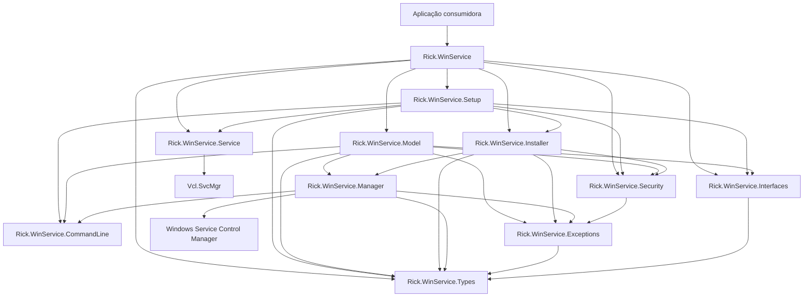
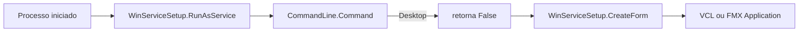
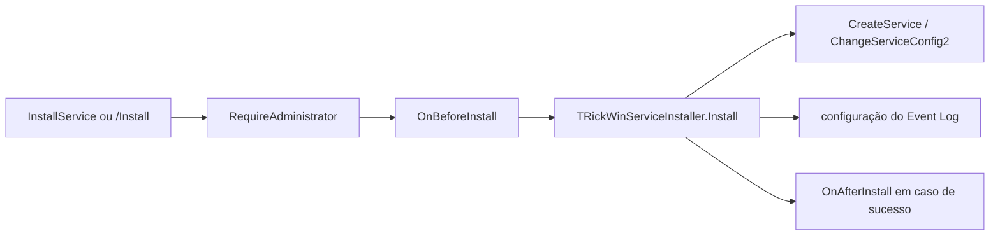
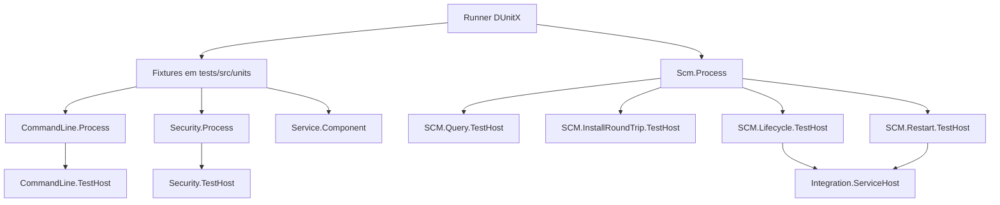

# Arquitetura

Este documento descreve a arquitetura observável no estado atual. Ele não reconstrói a evolução histórica do projeto.

## Visão geral

O Rick WinService separa a API consumida pela aplicação das responsabilidades de configuração, execução do serviço, acesso ao SCM, instalação, segurança, linha de comando e erros.



O diagrama mostra dependências relevantes entre units do próprio projeto. Dependências de RTL, VCL, FMX e WinAPI foram resumidas.

## Estrutura de `src`

O pacote atual contém 11 units `.pas` e um DFM principal do serviço:

```text
src/
├── Rick.WinService.pas
├── Rick.WinService.Types.pas
├── Rick.WinService.Interfaces.pas
├── Rick.WinService.Exceptions.pas
├── Rick.WinService.Security.pas
├── Rick.WinService.Manager.pas
├── Rick.WinService.Installer.pas
├── Rick.WinService.CommandLine.pas
├── Rick.WinService.Model.pas
├── Rick.WinService.Setup.pas
├── Rick.WinService.Service.pas
└── Rick.WinService.Service.dfm
```

## Responsabilidades

### `Rick.WinService.pas`

Fachada procedural principal. Expõe configuração, identificação VCL/FMX, consultas, verificação administrativa e operações de instalação/controle.

Dependências internas de implementação observadas:

```text
Installer
Model
Security
Service
Setup
```

### `Rick.WinService.Types.pas`

Declara apenas tipos compartilhados:

- `TRickWinServiceState`;
- `TInstallType`;
- `TRickWinServiceOperation`;
- `TRickApplicationFramework`;
- `TOnRickWinServiceEvent`.

Não possui lógica de execução.

### `Rick.WinService.Interfaces.pas`

Declara:

- `IRickWinService`;
- `IRickWinServiceSetup`.

Depende de `Rick.WinService.Types` e de tipos da RTL necessários aos contratos.

### `Rick.WinService.Exceptions.pas`

Declara a hierarquia de exceções controladas. Depende de `Rick.WinService.Types` para operações e estados.

### `Rick.WinService.Security.pas`

Implementa a validação do token efetivo contra o grupo Administrators usando `AllocateAndInitializeSid` e uma importação explícita de `CheckTokenMembership` de `advapi32.dll`.

`RequireAdministrator` lança `ERickWinServiceAdministratorRequired` quando o processo não está elevado.

### `Rick.WinService.Manager.pas`

Gateway de baixo nível para o SCM. Entre as responsabilidades observadas estão:

- abrir e fechar handles do SCM e do serviço;
- registrar e remover serviço;
- alterar a descrição;
- consultar `SERVICE_STATUS_PROCESS`;
- iniciar, parar, pausar, continuar e enviar shutdown;
- converter estados Win32 em `TRickWinServiceState`;
- aguardar transições;
- consultar instalação e execução por nome.

O timeout padrão interno de `WaitForState` e `WaitForStateOrRaise` é `30000` ms.

Durante a espera, o código calcula o intervalo a partir de `dwWaitHint div 10`, limitado entre 100 e 1000 ms, e acompanha `dwCheckPoint` para detectar ausência de progresso.

### `Rick.WinService.Installer.pas`

Núcleo de instalação e desinstalação utilizado pela fachada e pelos comandos administrativos.

Na instalação:

1. exige privilégio administrativo;
2. valida nome do serviço e executável;
3. usa o nome interno como título quando `ServiceTitle` está vazio;
4. registra `SERVICE_WIN32_OWN_PROCESS`, `SERVICE_AUTO_START` e `SERVICE_ERROR_NORMAL`;
5. configura `ImagePath` como `"<executavel>" -RunService`;
6. aplica descrição por `ChangeServiceConfig2` quando `ServiceDetail` não está vazio;
7. tenta configurar a origem do Event Log.

Se uma falha ocorrer depois da criação do serviço, o rollback tenta remover o registro e a origem do Event Log, preservando a exceção original caso as tentativas de limpeza também falhem.

`ConfigureEventLog` usa:

```text
HKLM\SYSTEM\CurrentControlSet\Services\Eventlog\Application\<ServiceName>
```

Quando a chave é aberta/criada, grava:

```text
EventMessageFile = <executavel>
TypesSupported   = 7
Description      = <ServiceDetail>   (quando informado)
```

Se `TRegistry.OpenKey` retornar `False`, o método retorna sem lançar exceção. Na remoção, o retorno Boolean de `DeleteKey` não é transformado em erro. Por isso, a documentação trata Event Log como uma tentativa, não como garantia de alteração do Registro.

### `Rick.WinService.CommandLine.pas`

Interpreta o modo de inicialização e mapeia exceções para códigos de saída.

Modos:

```text
Desktop
Install
Uninstall
RunService
```

### `Rick.WinService.Model.pas`

Implementa `IRickWinService`.

- consultas e Start/Stop/Restart usam `TRickWinServiceManager`;
- `Install`/`Uninstall` executam um processo auxiliar do próprio binário com `/Install` ou `/UnInstall` e `/Silent`;
- validações administrativas ocorrem antes das operações mutáveis.

### `Rick.WinService.Setup.pas`

Implementa `IRickWinServiceSetup` e coordena os modos do mesmo executável:

```text
Desktop       -> retorna False
Install       -> executa Installer e retorna True
Uninstall     -> executa Installer e retorna True
RunService    -> executa Vcl.SvcMgr.Application e retorna True após o runtime
```

Também mantém e encaminha callbacks de ciclo de vida e de instalação/desinstalação.

### `Rick.WinService.Service.pas`

Declara `TRickWinService = class(TService)` e os metadados globais:

```text
ServiceName
ServiceTitle
ServiceDetail
```

`ServiceExecute` executa:

```delphi
while not Self.Terminated do
  ServiceThread.ProcessRequests(True);
```

### `Rick.WinService.Service.dfm`

Mantém a configuração física do serviço:

```text
object RickWinService: TRickWinService
  DisplayName = 'RickWinService'
  OnExecute = ServiceExecute
end
```

`Name` e `DisplayName` são atualizados em runtime pelo construtor de `TRickWinService` com os valores configurados.

## Fluxo Desktop



## Fluxo de instalação



Na fachada `InstallService`, o processo não cria uma segunda instância. No contrato `IRickWinService.Install`, `TRickWinServiceModel` usa um processo auxiliar que termina no mesmo `Installer` por meio de `/Install`.

## Fluxo de execução como serviço


## Fluxo Start/Stop


## Separação de UI

As units de segurança, exceções, Manager, Installer e CommandLine não dependem de formulários para apresentar erros. As falhas são devolvidas por exceção ou ExitCode, conforme o caminho.

O modo Desktop depende condicionalmente de `FMX.Forms` ou `Vcl.Forms`; o modo Windows Service depende de `Vcl.SvcMgr`.

## Arquitetura de testes

A suíte de testes é mantida separadamente do código de produção e utiliza um runner DUnitX central, fixtures organizadas por responsabilidade e Test Hosts para comportamentos que precisam ocorrer em processos independentes ou contra o SCM real.

```text
RickWinService.Tests
│
├── units/
│   ├── testes unitários
│   ├── testes por processo
│   └── teste do componente de serviço
│
├── component/
│   ├── CommandLine.TestHost
│   └── Security.TestHost
│
└── integration/
    ├── Scm.Process
    ├── Query.TestHost
    ├── InstallRoundTrip.TestHost
    ├── Lifecycle.TestHost
    ├── Restart.TestHost
    └── Integration.ServiceHost
```

O fluxo geral é:



Responsabilidades:

- `tests/src/units`: fixtures registradas no runner DUnitX;
- `tests/src/component`: processos auxiliares para validar CommandLine e Security fora do processo do runner;
- `tests/src/integration`: orquestração e Test Hosts que exercitam o Windows SCM real;
- `RickWinService.Integration.ServiceHost`: executável mínimo utilizado como serviço temporário nos cenários Lifecycle e Restart.

A suíte final possui 57 testes em 9 fixtures. Os detalhes de build, execução, cenários SCM, cleanup, baseline validada e Method Toxicity Metrics estão em [`TESTING.pt-BR.md`](TESTING.pt-BR.md).

